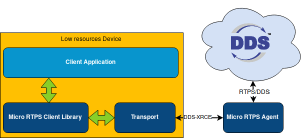

# Micro RTPS Client

In *Micro RTPS* a *Micro RTPS Client* can communicate with DDS Network as any other DDS actor could do. Clients can publish and subscribe to data topics in DDS Global Data Space. *Micro RTPS* provides you with a C API to create *Micro RTPS Clients*.

## Documentation

You can access Micro-RTPS documentation online, which is hosted on Read the Docs.

* [Start Page](http://micro-rtps.readthedocs.io)
* [Installation manual](http://micro-rtps.readthedocs.io/en/latest/installation.html)
* [User manual](http://micro-rtps.readthedocs.io/en/latest/introduction.html)

## Getting Help

If you need support you can reach us by mail at `support@eProsima.com` or by phone at `+34 91 804 34 48`.
